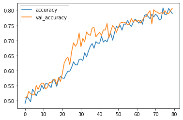
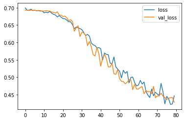

# Speaker Recogniton using Siamese Network

### In this project Siamese Network is used to classify whether a given two audio sample belongs to same person or not

### Siamese network is a type of One Shot Learning which requires less number of data to train the model.
### Some resources for learning siamese network:
    * https://towardsdatascience.com/one-shot-learning-with-siamese-networks-using-keras-17f34e75bb3d
    * https://medium.com/@prabhnoor0212/siamese-network-keras-31a3a8f37d04

## Dataset :    https://www.kaggle.com/uwrfkaggler/ravdess-emotional-song-audio

## Tools Used
* Kaggle kernel/Google Colab with GPU runtime

## Implementaion Steps
* Read the Audio data  and calculate the spectogram of that audio.
    * A spectrogram is a visual way of representing the signal strength, or “loudness”, of a signal over time at various frequencies present in a particular waveform.
    Learn more about spectogram and audio data
        * https://www.kdnuggets.com/2020/02/audio-data-analysis-deep-learning-python-part-1.html

* Store the audio data in array format and target data
* Convert target data into label encoding and split the data.
*  Make the pairs of data as it will be necessary to send the data in pairs for Siamese Network
    * Note: The make_pairs function used in this notebook will need the target(y) data as label encoding

* Make the siamese network architecture with the shape of data and train the model using proper loss and optimizer

    * Note : Since I have used this in Colab/Kaggle, if the number of parameters increase from certain limit then it cannot process it. And this notebook will need GPU runtime to process.

## Accuracy and Loss

### This model has validation accuracy of 80%. 

# Conclusion

### This is a simple implementaion of the siamese network with audio data. To make this data more robust, it requires more computation power and more number of target person data. 
